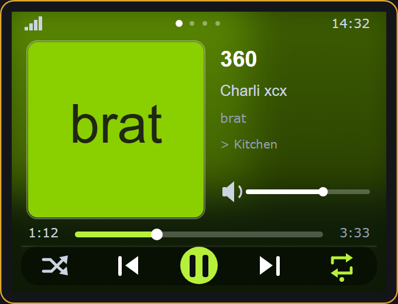
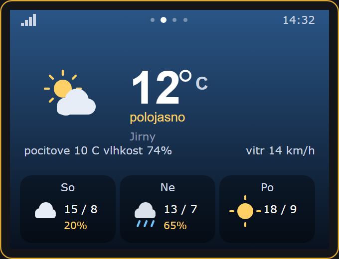
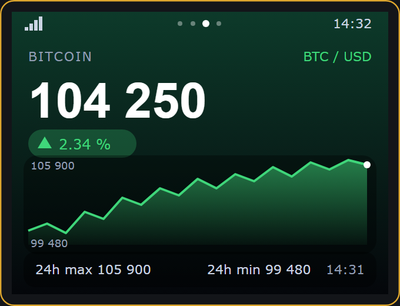
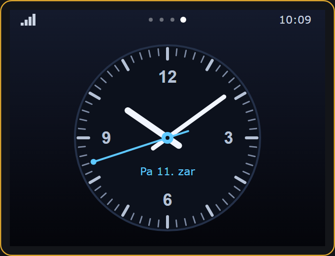

# SpotifyDeck

*[Česká verze](README.cs.md)*

Four pages on one cheap touchscreen board: a **Spotify remote**, **weather**,
a **Bitcoin ticker** and an **analogue clock**. Swipe to switch between them.

Runs on the ESP32-2432S028R, better known as the **CYD — "Cheap Yellow Display"**.
No soldering, no wiring: one board and a USB cable.

| | |
|---|---|
|  |  |
|  |  |

> The whole on-screen interface is available in **Czech and English**.
> Long-press anywhere → *Language*. The choice is stored on the device.

---

## What it does

### 1 · Spotify

- **The album cover, blurred across the whole screen** as the background, plus a
  sharp copy of the cover on the left. The blur is free: the same JPEG is simply
  decoded a second time at 1:8 scale (300×300 → 37×37 px), box-blurred twice and
  stretched back up bilinearly.
- **Automatic background exposure.** A bright cover (Charli xcx's *brat* is the
  worst case) gets dimmed, a dark one lifted, so white text always stays legible.
- Track / artist / album, with **long titles scrolling by themselves**.
- **Progress** is interpolated locally between polls, so the bar moves smoothly
  even though the server is only asked every 3 seconds. Drag it to seek.
- **Play / pause / next / previous / shuffle / repeat**, volume by dragging.
- Tap the cover for a full-screen view.
- Handles **podcasts** (episodes) and multiple artists.
- Respects Spotify's `actions.disallows` — whatever is currently not permitted
  is greyed out instead of failing silently.

### 2 · Weather

- Powered by **Open-Meteo** — free, **no API key, no signup**.
- Temperature, apparent temperature, humidity, wind, a description, and a
  three-day forecast.
- **Weather icons drawn from primitives** (sun, moon, clouds, rain, snow, fog,
  thunderstorm) — no bitmaps, so they stay crisp at any size.
- The background colour follows the conditions and the time of day.
- **Set the location by name** ("Jirny", "Prague") in the WiFi portal; it is
  resolved to coordinates through the geocoding API and stored in NVS.

### 3 · Bitcoin

- Price from the public **Binance API** (no key), plus a **48-hour chart**.
- 24-hour change, high and low.
- Currency **USD / EUR / CZK** — tap the upper half to cycle. Binance has no
  CZK pair, so korunas are derived from the **Czech National Bank daily rate**.
- The background turns green or red depending on where the day went.

### 4 · Clock

- Analogue face with anti-aliased hands, 60 tick marks and the date.
- Composed in a sprite and pushed in one go, so **the hands never flicker**.
- Tap to switch to a large digital readout.
- Time from NTP, Central European timezone including DST.

### Everywhere

- **Swipe left / right** to change page.
- **Long press** opens settings: touch calibration, display rotation,
  WiFi portal, language, artwork cache, restart.
- **On-device touch calibration** — two targets, result stored in NVS. It even
  detects a swapped axis. No editing constants in the source.
- **Automatic backlight dimming** after inactivity, optionally following the
  ambient light sensor on the board.
- The **RGB LED** on the board glows in the album's dominant colour.
- The backlight briefly dips during a full repaint, turning the jerky
  block-by-block JPEG reveal into a smooth cross-fade.

---

## What you need

| Item | Note |
|---|---|
| An **ESP32-2432S028R** (CYD) board | 2.8" 320×240, resistive touch |
| A **USB cable that carries data** | A charge-only cable will not enumerate |
| **Spotify Premium** | Playback control is Premium-only |
| Arduino IDE | version 2.x |
| Python 3.8+ | only to fetch the token, once |

The WiFi network must be **2.4 GHz** — the ESP32 cannot join 5 GHz.

---

## Step by step

### 1. Add ESP32 support to the Arduino IDE

**File → Preferences → Additional Boards Manager URLs:**

```
https://raw.githubusercontent.com/espressif/arduino-esp32/gh-pages/package_esp32_index.json
```

Then **Tools → Board → Boards Manager**, search for `esp32` and install the
package by **Espressif Systems**.

### 2. Libraries

**Tools → Manage Libraries**, install:

| Library | Author |
|---|---|
| `TFT_eSPI` | Bodmer |
| `TJpg_Decoder` | Bodmer |
| `XPT2046_Touchscreen` | Paul Stoffregen |
| `ArduinoJson` | Benoit Blanchon |
| `WiFiManager` | tzapu |

> Unlike most guides floating around, **no Spotify library ZIP is required**.
> The Spotify API client is part of this project (`DeckSpotify.cpp`) — it is
> smaller, handles errors properly, and there is no
> "SpotifyArduino.h not found" to debug.

### 3. Display configuration

Copy `User_Setup.h` from the repository root over:

```
Documents/Arduino/libraries/TFT_eSPI/User_Setup.h
```

> ⚠️ **That file is global to your machine.** Overwriting it changes the display
> configuration for every other TFT_eSPI project you have. Back up the original
> as `User_Setup.h.bak` first.

If your CYD already works, **you do not have to change anything** — the project
runs fine on the usual `ILI9341_DRIVER` configuration. The bundled file merely
adds `USE_HSPI_PORT` (the display really is on HSPI, so it is faster) and `TFT_BL`.

**Two USB connectors (micro + USB-C)?** That is the newer board with an
**ST7789** controller — in `User_Setup.h` comment out block A and uncomment block B.

### 4. Spotify application

1. [developer.spotify.com/dashboard](https://developer.spotify.com/dashboard) → **Create app**
2. Redirect URI, **exactly**:
   ```
   http://127.0.0.1:8888/callback
   ```
3. Tick **Web API**, save.
4. Copy the **Client ID** and **Client secret**.

### 5. Token

From the repository root:

```bash
python tools/get_token.py
```

(On Windows you can also just double-click `tools/get_token.bat`.)

The script starts a local server, opens the browser, catches the callback code,
exchanges it for a token and **writes `SpotifyDeck/secrets.h` for you**. No
copying codes out of the address bar, no curl, no race against the code's
ten-minute lifetime.

### 6. Upload

Open `SpotifyDeck/SpotifyDeck.ino` and set:

| Tools → | Value |
|---|---|
| Board | **ESP32 Dev Module** |
| Partition Scheme | **Huge APP (3MB No OTA / 1MB SPIFFS)** |
| PSRAM | **Disabled** (the WROOM module has none) |
| Flash Size | 4MB (32Mb) |
| Upload Speed | 921600, or 115200 if uploads fail |

Then hit **Upload**. If it hangs on "Connecting...", hold the **BOOT** button
until it starts writing.

### 7. First boot

1. The board creates a WiFi network called **`SpotifyDeck`**, password
   **`spotifydeck`**.
2. Join it from your phone; the portal opens.
3. Pick your WiFi, enter the password, and type your town into the
   **"City for weather"** field.
4. After it restarts the board walks you through **touch calibration** —
   tap the centre of each target twice.

Done.

---

## Controls

| Gesture | Action |
|---|---|
| Swipe left / right | Next / previous page |
| Long press (≈1 s) | Settings |
| Tap a button | That command |
| Drag the progress bar | Seek |
| Drag the volume bar | Volume |
| Tap the cover | Full-screen artwork |
| Tap the clock | Analogue ⇄ digital |
| Tap the top of the BTC page | USD → EUR → CZK |
| Tap the weather | Force a refresh |

---

## Configuration

Everything tunable lives in [`SpotifyDeck/DeckConfig.h`](SpotifyDeck/DeckConfig.h).

```c
#define FEAT_BLUR_BACKGROUND  1   // blurred cover as the background
#define FEAT_FULLSCREEN_ART   1   // tap the cover
#define FEAT_VOLUME_SLIDER    1
#define FEAT_SEEK_BAR         1
#define FEAT_AUTO_DIM         1   // dim after inactivity
#define FEAT_LDR_BRIGHTNESS   1   // follow the ambient light sensor
#define FEAT_RGB_LED          1   // LED in the album colour
#define FEAT_ART_CACHE        1   // artwork cache in LittleFS
#define FEAT_NTP_CLOCK        1

#define DEFAULT_LANG_EN       0   // 1 = start in English
```

The same file holds the screen layout (coordinates of every element), poll
intervals, timezone, and the WiFi portal's name and password.

---

## How it works inside

```
SpotifyDeck/
├─ SpotifyDeck.ino    page switching, state machine, touch
├─ DeckConfig.h       pins, feature flags, screen layout
├─ secrets.h          credentials (gitignored, never committed)
│
├─ DeckHttp.*         one shared HTTP/HTTPS client for every module
├─ DeckSpotify.*      Spotify Web API - token, state, control, artwork
├─ DeckWeather.*      Open-Meteo + geocoding
├─ DeckCrypto.*       Binance + the CNB daily rate
├─ DeckClock.*        analogue clock in a sprite
│
├─ DeckArt.*          artwork decoding, dominant colour, blurred background
├─ DeckDraw.*         shared text sprite, palette, glass panels
├─ DeckUi.*           Spotify screens, status bar, settings, backlight
├─ DeckIcons.*        every icon, drawn from primitives
├─ DeckLang.*         Czech / English interface strings
├─ DeckColor.h        colour maths (RGB565/888, HSV, blending)
├─ DeckText.h         UTF-8 → ASCII folding
├─ DeckTouch.*        touch handling and calibration
├─ DeckNet.*          WiFi, config portal, NTP
└─ DeckTft.h          the one global display instance
```

A few decisions worth explaining:

**One TLS session for everything.** After WiFi comes up an ESP32 without PSRAM
has roughly 250 KB of free heap, and a single TLS connection eats 40–50 KB of
it. Giving every module its own `WiFiClientSecure` would run the board out of
memory. So `DeckHttp` owns one client for all of them — including the check that
a reused connection is not sent to a different host, which `HTTPClient` does
*not* do on its own.

**Album art over plain HTTP.** `i.scdn.co` serves the images without TLS. They
are public images, so nothing is at risk, and it saves the entire TLS buffer and
handshake. On a board without PSRAM that is the difference between "works" and
"out of memory".

**A JSON filter.** The `/v1/me/player` response is several kB. The `market=CZ`
parameter removes 1.5 kB of available-markets list, and ArduinoJson's filter
keeps only the fields that actually get drawn — about 1 kB.

**Text through a sprite.** Each line is composed off-screen (background plus
text) and only the finished result is sent to the display. That is why nothing
flickers over the blurred cover, even though it repaints every second.

**Dithering.** RGB565 has only 64 levels in the green channel, so a smooth
gradient down the screen breaks into visible bands. A 4×4 Bayer matrix applied
before rounding removes them.

---

## Security

- **`secrets.h` is gitignored.** Only `secrets.example.h` is committed. If your
  refresh token ever leaks, hit *Rotate client secret* in the Spotify dashboard
  and the old one dies immediately.
- **TLS certificates are not verified** (`setInsecure()`). For a device like this
  on a home network that is the usual trade-off; it saves flash and the chore of
  maintaining root certificates. Swap in `setCACert()` in `DeckHttp.cpp` if you
  want the guarantee.
- Album art travels over **plain HTTP** — public data, no credentials involved.
- **Spotify refresh tokens last 6 months.** After that you need a new one; the
  board tells you so on screen.

---

## Known limits

- **The display cannot do accented characters.** Both the built-in TFT_eSPI fonts
  and the Adafruit FreeFonts are ASCII-only. The project therefore folds every
  string coming off the network (`DeckText.h`) — "Dvořák" shows up as "Dvorak"
  rather than as two empty rectangles.
- Playback control **requires Spotify Premium**; without it the API returns 403.
- The display **plays nothing** — it mirrors whatever is playing elsewhere.
- The Binance API is unreachable from some countries; the page says so.

---

## Troubleshooting

| Problem | Fix |
|---|---|
| Upload hangs on "Connecting..." | Different (data) cable, or hold BOOT |
| No port under Tools → Port | Charge-only cable, or missing CH340 driver |
| Colours look inverted | Two-USB board → switch `User_Setup.h` to block B (ST7789) |
| Touch lands next to the button | Long press → **Touch calibration** |
| Image is upside down | Long press → **Rotate display** |
| "Nothing is playing" while it is | Spotify has to be actually playing on some device; this only mirrors it |
| "Premium required" | Playback control is Premium-only |
| "Spotify signed out" | The refresh token expired (6 months) → run `tools/get_token.py` again |
| Weather says "place not found" | Type the town without accents, or add the country |
| White/black screen after boot | Check that `User_Setup.h` really is in `libraries/TFT_eSPI/` |
| Occasional noise on screen | Lower `SPI_FREQUENCY` to `40000000` in `User_Setup.h` |

The serial monitor at **115200 baud** narrates everything — WiFi, tokens, and
the size of each downloaded cover.

---

## Licence

MIT — see [LICENSE](LICENSE).

Data: [Spotify Web API](https://developer.spotify.com/documentation/web-api),
[Open-Meteo](https://open-meteo.com/) (CC BY 4.0),
[Binance](https://binance-docs.github.io/apidocs/spot/en/),
[Czech National Bank](https://www.cnb.cz/en/financial-markets/foreign-exchange-market/).
